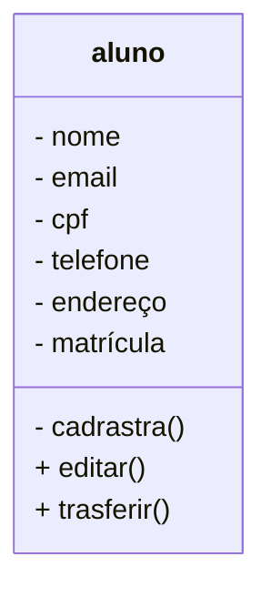

# Projeto Universidade

Modelagem em Orientação à Objetos das Entidades Alunos, Cursos e Turmas.

## Caso de Uso

## Diagrama de Classes

# App Desktop

Este é um projeto desktop, utilizando as tecnologias:

- Python
- PySide6
- PyInstaller

# Funções MySQL

- CREATE - Cria tabelas dentro da base de dados.
- INSERT - Cria registros dentro das tabelas.

- SELECT - Permite visualizar os dados dentro das tabelas. Também permite filtrar os dados que quer visualizar.

- ALTER - Altera a estrutura das tabelas, adicionando ou removendo atributos(campos).
- UPDATE - Atualiza regristros dentro da tabela.

- DROP - Exclui a tabela ou a base de dados inteira.
- DELETE - Exclui registros dentro das tabelas.

# MySQL

- Banco de Dados: Programa hospedado na máquina, com objetivo de persistir os dados fisicamente no HD.

- Base de Dados: Conjunto de tabelas.

- Tabelas: Conjunto de registros.

- Registros: Uma linha na tabela, contendo a informação dos seus atributos.

- Atributos: Uma das caracteristicas da tabela (Colunas).

## Dependências
- **VSCode**: IDE(interface de Desenvolvimento)

- **Mermaind**: Linguagem para confecção de Diagramas em Documentos MD (Mark Down)

- **Matherial**: Tema para colorir as pastas.

- **Git lens**: Interface gráfica pra o versionamento .git intergrada ao VSCode.
- **MYSGL**: SGBD (Sistema Gereciador do Banco de Dados).permite conectar o usuario como servidoe MySQL, possibilitanto  criar base de dados, tabelas, incluir e modificar atributos e registros.