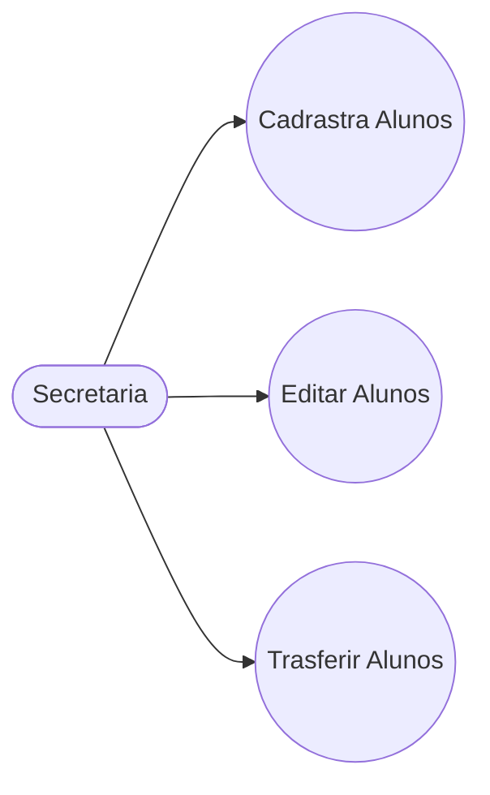
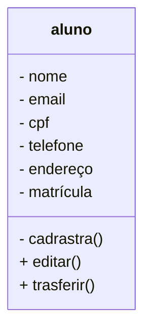

# Projeto Universidade

Modelagem em Orientação à Objetos das Entidades Alunos, Cursos e Turmas.

## Caso de Uso

## Diagrama de Classes

## Dependências
- **VSCode**: IDE(interface de Desenvolvimento)

- **Mermaind**: Linguagem para confecção de Diagramas em Documentos MD (Mark Down)

- **Matherial**: Tema para colorir as pastas.

- **Git lens**: Interface gráfica pra o versionamento .git intergrada ao VSCode.